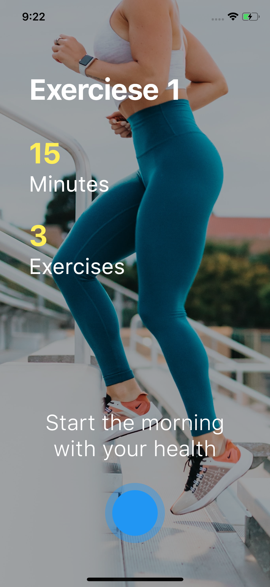
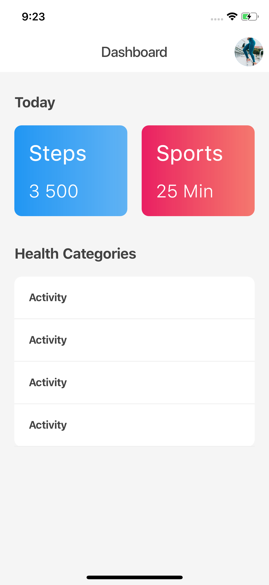

## Flutter Page Transition Animation, Application Design - Day 6

```dart
class Afgprogrammer extends Flutter100DaysOfCode {
  video() {
    return {
      "title": "Flutter Page Transition Animation, Application Design",
      "description": "Let's see how PageTransition animation works in flutter.",
      "day": 6,
      "videoLink": "https://youtu.be/KEUKRT9Xsls"
    }
  }
}
```

[Youtube Video](https://youtu.be/KEUKRT9Xsls)
<br><br>
## Previous Designs
[Checkout my Youtube channel](https://youtube.com/afgprogrammer)

## Development Setup
Clone the repository and run the following commands:
```
flutter pub get
flutter run
```

## ScreenShot

&nbsp;

## Links

* [Website](https://afgprogrammer.com)
* [Youtube channel](https://youtube.com/afgprogrammer)
* [Twitter](https://twitter.com/afgprogrammer)
* [Instagram](https://instagram.com/afgprogrammer)
